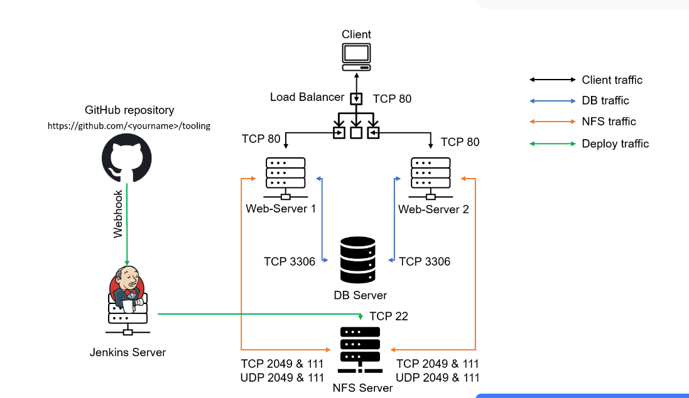

## Project-9-TOOLING WEBSITE DEPLOYMENT AUTOMATION WITH CONTINUOUS INTEGRATION. INTRODUCTION TO JENKINS

 
In this project we are going to start automating part of our routine tasks with a free and open source automation server – Jenkins. It is one of the mostl popular CI/CD tools, it was created by a former Sun Microsystems developer Kohsuke Kawaguchi and the project originally had a named "Hudson".

 
Acording to Circle CI, Continuous integration (CI) is a software development strategy that increases the speed of development while ensuring the quality of the code that teams deploy. Developers continually commit code in small increments (at least daily, or even several times a day), which is then automatically built and tested before it is merged with the shared repository.

In our project we are going to utilize Jenkins CI capabilities to make sure that every change made to the source code in GitHub https://github.com/<yourname>/tooling will be automatically be updated to the Tooling Website.

Task

Enhance the architecture prepared in Project 8 by adding a Jenkins server, configure a job to automatically deploy source codes changes from Git to NFS server.

Here is how your updated architecture will look like upon competion of this project: 

 

