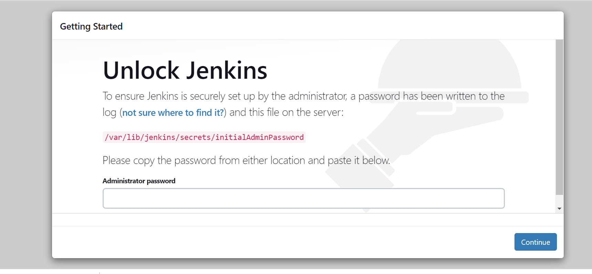
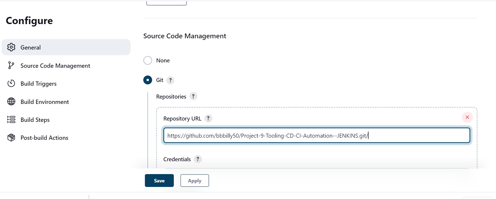

## **TOOLING WEBSITE DEPLOYMENT AUTOMATION WITH CONTINUOUS INTEGRATION. INTRODUCTION TO JENKINS**
---
---
</br>

### **INSTALL AND CONFIGURE JENKINS SERVER**

</br>

**Step 1 – Install Jenkins server**

</br>

1. Create an AWS EC2 server based on Ubuntu Server 20.04 LTS and name it `"Jenkins"`

2. Install `JDK` (since Jenkins is a Java-based application)

`sudo apt update`

`sudo apt install default-jdk-headless`

3. Install Jenkins

</br>

```py
wget -q -O - https://pkg.jenkins.io/debian-stable/jenkins.io.key | sudo apt-key add -
sudo sh -c 'echo deb https://pkg.jenkins.io/debian-stable binary/ > \
    /etc/apt/sources.list.d/jenkins.list'
sudo apt update
sudo apt-get install jenkins
```
Make sure Jenkins is up and running

`sudo systemctl status jenkins`


</br>

4. By default `Jenkins server uses TCP port 8080` – open it by creating a new Inbound Rule in the EC2 Security Group
   

   
</br>

1. Perform initial Jenkins setup.
From your browser access 

`http://<Jenkins-Server-Public-IP-Address-or-Public-DNS-Name>:8080`



You will be prompted to provide a default admin password

Retrieve it from your server:

`sudo cat /var/lib/jenkins/secrets/initialAdminPassword`

Then you will be asked which plugings to install – choose `suggested plugins`.

Once plugins installation is done – create an admin user and we will get the Jenkins server address.


</br>


</br>

### **Step 2 – Configure `Jenkins` to retrieve `source codes` from `GitHub using Webhooks`**

</br>

Configure a  `Jenkins job/project`  This job will will be `triggered` by `GitHub webhooks` and will `execute a ‘build’ task` to retrieve codes from GitHub and store it locally on Jenkins server.

1. Enable webhooks in your GitHub repository settings

</br>


</br>


</br>

2. Go to Jenkins web console, click `"New Item"` and create a `"Freestyle project"`
   
   

To connect your GitHub repository, we will need to provide its URL, we can copy from the repository itself

In configuration of `Jenkins freestyle project` choose `Git repository`, provide there the link to the Tooling GitHub repository and credentials (user/password) so Jenkins could access files in the repository.

`Save the configuration` and let us try to run the build. For now we can only do it manually.



Click `"Build Now"` button, if you have configured everything correctly, the build will be successfull and you will see it under #1


This build does not produce anything and it runs only when we trigger it manually. Let us fix it.

3. Click `"Configure" your job/project` and add these two configurations

   - **Configure triggering the job from GitHub webhook:**

</br>


</br>

   - **Configure `"Post-build Actions"` to archive all the files – files resulted from a build are called `"artifacts"`.**


Now, let make some change in any file in our GitHub repository (e.g. README.MD file) and push the changes to the master branch.

You will see that a new build has been launched automatically (by webhook) and you can see its `results – artifacts, saved on Jenkins server`.

